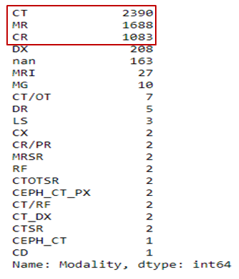
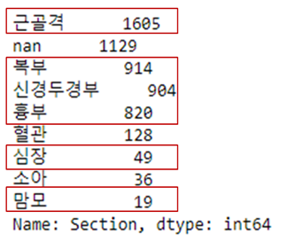
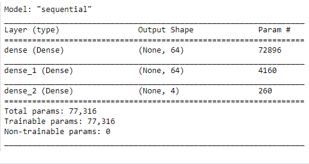
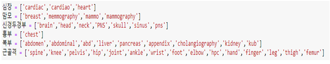
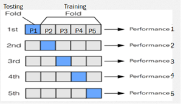
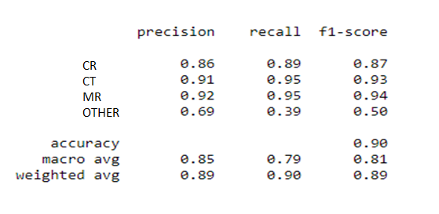
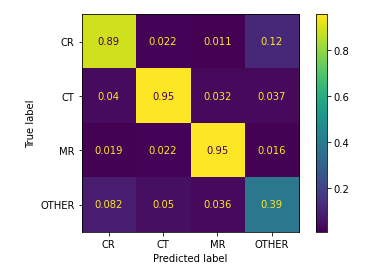
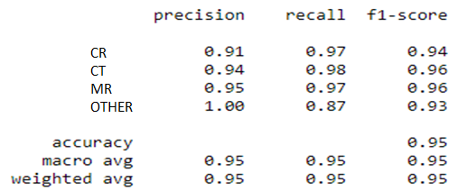
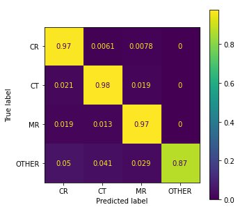
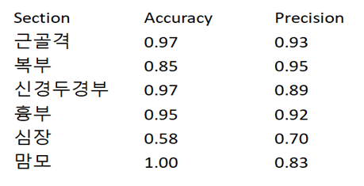

# Radiology-Modality-and-Body-Part-Prediction
Prediction of Modality and body part given hospital name and study description using Natural Language Processing (NLP)
 
# HTrams-AI
The goal of the project is:
- To predict the modality based on Hospital name and Study Description.
- To predict Section based on Study Description. 

Dataset has a total of 5570 non-duplicate entries and 4 columns in both Korean and English language and is provided in dataset folder.

## Data Preprocessing: 
### For Modality Prediction:  
Following are the preprocessing techniques applied to the data:
- Concatenation of both input columns “Hospital” and “StudyDescription” into one “input” column.
- Tokenization of each row in “input” column.
- Lowercase the tokens.
- Removing all digits, punctuation marks and parenthesis, keeping only alphabets.
- Lower case the “Modality” column to get “Mod” column.
- Replace modalities except [‘cr’, ‘ct’ ,‘mr’] in the ‘Mod’ and 'Modality' column with ‘other’.
- Making a new data frame with only “input” and “Modality” column.
- Make two word corpora as:
  - Input data corpus: Contains all the words in “input” and “Mod” column. 
    Input data Corpus has 1138 words for our dataset.
  - Modality corpus: Contains all the modalities. 
    Modality corpus has 4 words which are the 3 modalities and ‘other’ for all other modalities. 
- Index based encoding of each row in “input” column based on input data corpus.
- Converted index encoding into one hot encoding where the length of each one hot vector is equal to the total number of words in the input data corpus which is 1138 here.
- Converted “Modality” column in index and then one hot encoding vector too where the length of each vector is equal to the total number of modalities in Modality corpus.
### For Section Prediction: 
Following preprocessing techniques were applied for Section Prediction:
- Remove punctuation marks from study description.
- Split a sentence in study description into words.
- Keeping only the following section labels: 
‘근골격’,‘복부’,‘신경두경부’,‘흉부’,‘심장’,‘맘모’
## Dataset Distribution: 
For Modality prediction divided the total data of 5570 entries as:
- Training data: 4456
- Testing data: 1114  
For the model, Training data is further divided as:
- Training data: 3564
- Validation Data: 892
### Modality Distribution: 
Following is the Modality distribution in the data set:  
  
The algorithm will predict modalities inside red box as shown above because other modalities don’t have enough samples for the model to train and make predictions correctly.  
### Section Distribution:  
Following is the section distribution:  
   
The algorithm will predict sections inside red boxes as shown above. 
- Study description of ‘혈관’ is similar to the study description of ‘심장’ so we can only predict one of them. 
- Similarly ‘소아’ contains keywords of all other sections.
   
## Input to model:  
### For Modality Prediction:  
One hot encoded vectors of “input” column and “Mod” column.  
### For Section Prediction: 
Tokens of ‘Study Description’.  
## Modality Prediction technique:  
Trained the following model to get predictions:  
### Regularization Model:
- 2 densely connected layers of 64 hidden elements with Relu activation function and L2 Regularization.
- As we need to predict 4 different modality classes, the last layer has 4 hidden elements with Softmax activation function.
   
### Section Prediction technique:  
Following is the algorithm followed for Section Prediction:
- Made a list of keywords in ‘Study Description’ corresponding to each ‘Section’  as:  
   
- If the ‘Study Description’ has one of the key words as above, the algorithm will assign the corresponding ‘Section’.  
## K-Fold Cross validation for Modality Prediction:  
Divided the dataset in 5 parts as:  
P1 – 1114 entries  
P2 – 1114 entries  
P3 – 114 entries  
P4 – 1114 entries  
P5 – 1114 entries  
Checked performance of the model as shown below:  
   
And found the average of individual performances of all folds.  
### Results of Model:  
Following are the results after 5-fold cross validation of model for Modality Prediction for 3 Modalities:
   
### Normalized Confusion Matrix:
   
## Improvement of results for Modality Prediction:  
DL model **predicts for a given input** and returns an **array with probabilities of each class**. We assign the class with **maximum probability** to the given input. 
The above model is giving prediction on **maximum probability as low as 0.3** and the model is more likely to be giving **wrong prediction if the probability of assigned class is low**.  
So **to increase precision** of our model, we applied a **threshold of 0.85** to the probability. Model will only predict if the probability of predicted class is more than the threshold value.  
Following are the results after thresholding:  
   
### Normalized Confusion Matrix: 
   
## Results for Section Prediction:  
Following are the results of Section Prediction for 6 sections:  
   
## Limitations:  
- The algorithm will predict modalities [CR, CT, MR] because other modalities don’t have enough samples for the model to train and make predictions correctly.
- Study description of ‘혈관’ is similar to the study description of ‘심장’ so we can only predict one of them. 
- Similarly ‘소아’ contains keywords of all other sections.
- The algorithm predicts Modality for both Korean and English inputs but predicts the Section only for English entries of Study Description and not Korean.
